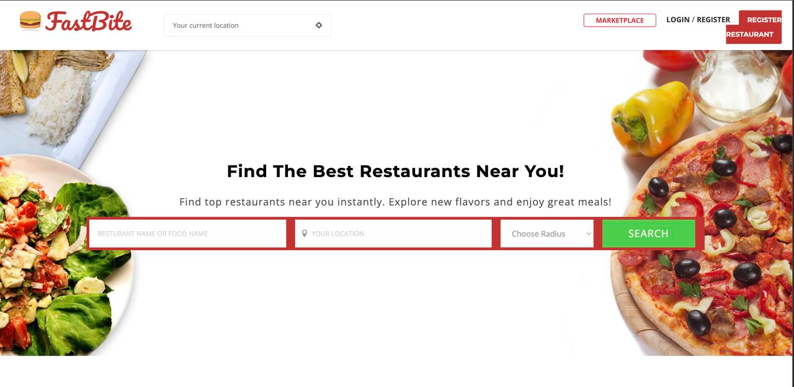

# FastBite

**FastBite** is a geolocation-based food marketplace built with Django. It connects users with local restaurants and vendors using precise mapping and location-aware features. FastBite also supports real-time order updates and PayPal payments.

## Screenshot

<div align="center">
  <p float="left">
    
  </p>
</div>

## Features

- 🌍 **Geolocation-based marketplace** using **PostGIS** and **GDAL**
- ⚙️ **Django** backend with custom **Signals** for real-time event handling
- 💳 **PayPal** integration for secure payments
- 📦 **PostgreSQL + PostGIS** for spatial queries and geo indexing

## Stack

| Layer            | Tech                 |
| ---------------- | -------------------- |
| Backend          | Django 4.x           |
| Database         | PostgreSQL + PostGIS |
| Geospatial Tools | GDAL                 |
| Payments         | PayPal SDK           |
| Deployment       | Gunicorn + Nginx     |

## Geolocation

FastBite leverages **PostGIS** to:

- Match users to nearby vendors
- Display results with accurate geospatial queries
- Optimize delivery logic based on coordinates

Ensure **GDAL** is properly installed and linked for geospatial support.

## Getting Started

```bash
# Clone the repo
git clone https://github.com/vfb-dev/fastBite.git
cd fastBite

# Setup virtual environment
python -m venv env
source env/bin/activate

# Install dependencies
pip install -r requirements.txt

# Migrate DB
python manage.py migrate

# Run server
python manage.py runserver
```

## Author

vfb-dev — Turning ideas into web apps
